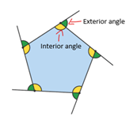

# Lab 1 - Getting Started with Python

Intro to Programming I

To get started, clone this repository with VS Code

Test Python install by opening the helloworld.py file and clicking the Run Python file in the upper right corner to run the file in terminal.

## Lab 1 steps

Task: Write 5 short Python programs.

1. Write a program to calculate the area of a rectangle.
    1. The area of a rectangle can be calculated using the formula A=lw where l is the length and w is the width.
    2. Open the file called rectangle_area.py
    3.	Ask the user to input the width and height separately.
    4. Calculate the area for a rectangle with those dimensions. Print the results with an appropriate message.
2. 	Write a program to calculate the interior and exterior angles for a regular polygon with a given number of sides.
    1. A regular polygon is one where all sides are the same length (a square is a regular rectangle; an octagon is an 8-sided regular polygon.) 
    
    

    2. The expression for calculating exterior angles is 360÷number of sides
    3. The expression for calculating interior angles is 180-exterior angle
	4. Open the file called regular_angles.py
	5. Ask the user for the number of sides the shape should have (make sure this is a whole number).
	6. Calculate the interior and exterior angles for that shape. Print the results with an appropriate message.
3. Write a program to convert Celsius temperature values to Fahrenheit.
	1. Open the file called celsius_to_fahr.py
	2. Ask the user for the temperature in Celsius. Output a message including the temperature converted to Fahrenheit.
    3. The conversion formula is: ℉=(℃*9/5)+32
4. When a user sets an alarm, they see a status telling them how many hours they have until that alarm goes off. Write a program to calculate that number.
    1. Open the file called hours_til_alarm.py
    2. Ask the user for the current time (in hours assuming a 24-hr-clock)
    3. Ask the user what time to set the alarm to (in hours assuming a 24-hr-clock). Assume you can only set an alarm to go off within the next 24 hours.
    4. Output a message telling the user how long in hours they have until their alarm goes off.
    5. Hint: If it’s 23:00 (11PM) and the user wants an alarm to go off at 7:00 (7AM), they have 8 hours before their alarm starts ringing. Think through the problem in your head, then design an equation to calculate it.
5. Write a program to calculate the length of a sentence.
    1. Open the file called sentence_length.py
    2. Ask the user to type a sentence. Print the number of characters.
    3. To compare the length of several sentences, we don’t need to know exactly how long they are. We just need an approximation. Calculate the number of characters in 10s rounded down to the nearest whole number. 
    4. Print the result multiplied by 10 to give the user the approximate length of their input.

Always run your python files to test them.

Don't forget to commit and publish your changes to GitHub.

**Submission Instructions**: Submit the link to your GitHub repository on classes. It should look something like this: https://github.com/PaceCS-121/cs121-lab1-username